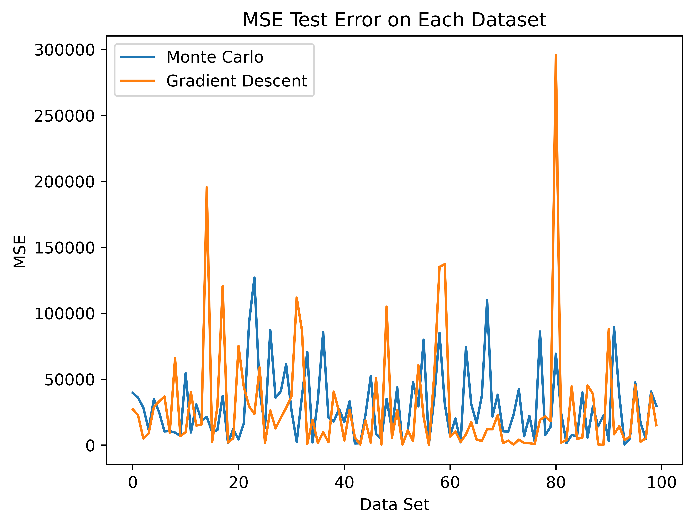
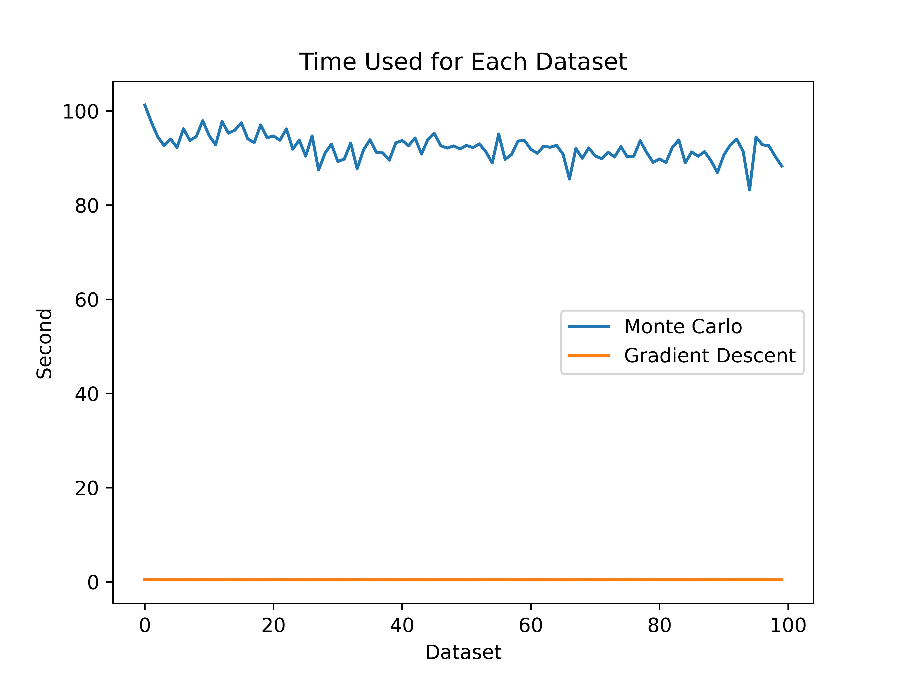
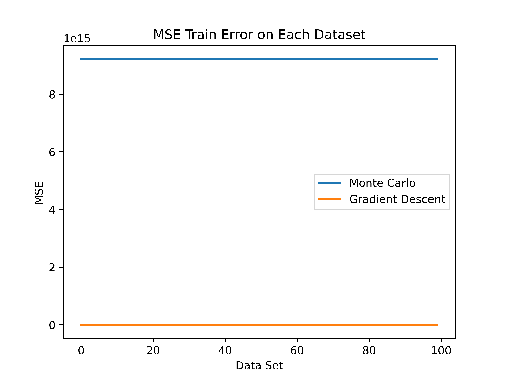
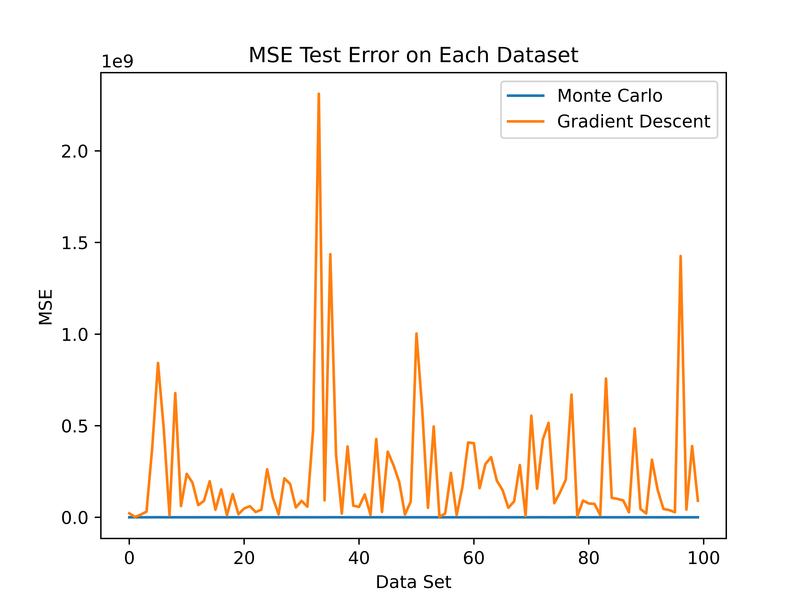
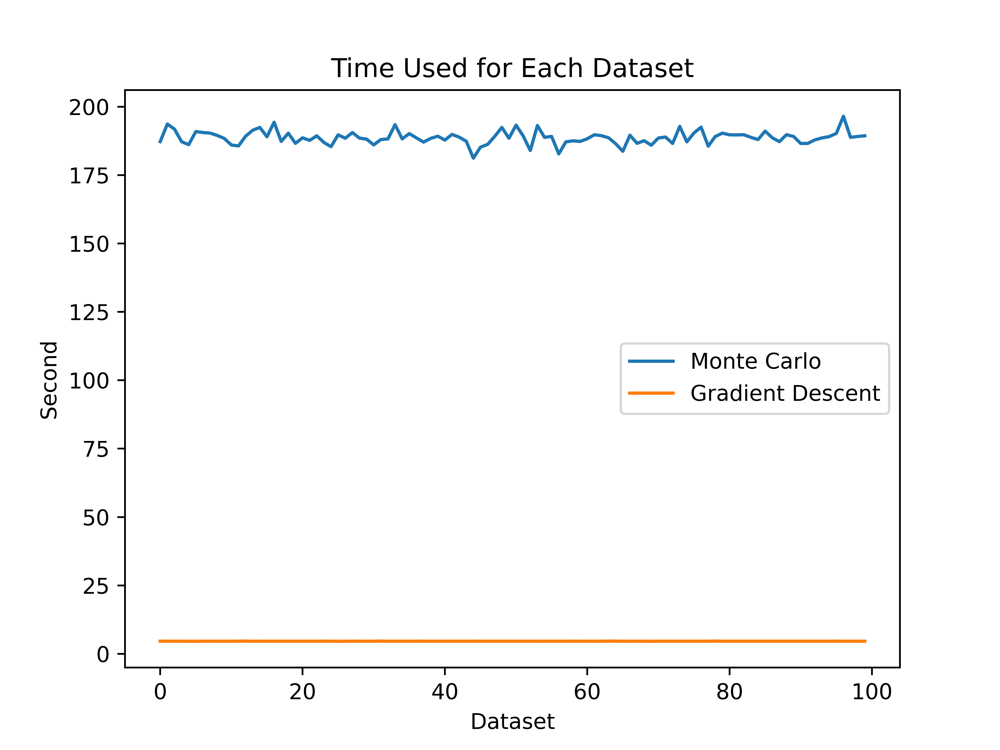

# Gradient Free Optimizer

In this research project, I am researching a gradient free optimizer that exploits multi-threads to search for the wegiths.

## 0521 Log
1. Using Monte Carlo with multiple threads to estimate the weights 
2. Comparing with tradition Gradient Descent algorithm

###Configuration

#### Over of test configuration
1.Number of test run: 100
NUmber of test run is how many tests we would like to compare the result from Monte Carlo simulation and the traditional gradient descent. In this configuration, we will compare a total of 100 results. 

#### Monte Carlo configuration
1. Number of Monte Carlo sample iteration (for each thread): 1000
2. Number of thread: 10
Number of Monte Carlo sample iteration is how many samples we create to estimate the weight for each data set in each thread. The total amount of thread we are using is 10.  

In this test run, we are running a total of 10,000 iterations for each data set to find the best result.

#### Gradient descent configuration
1. Gradient descent iteration: 10000
2. $\alpha$: 0.0001
Gradient descent iteration is the amount of iteration we will run for each data set. In addition, the $\alpha$ is the learning rate that is used.

#### Linear regression data configuration
1. Number of data sets (same as number of test run): 100
2. Number of observations for each data set: 1000
3. Number of coefficient: 3
4. Y intercept: Yes

### Data spliting configuration
1. 70/30 split

The amount of data set we generate will be the same as the number of test runs we would like to test. In addition, each data set has 1000 rows and 4 $\beta$ in total including $\beta_0,\; \beta_1,\; \beta_2,\; \beta_3$. To be fair, Gradient descent iteration will be the number of thread times number of Monte Carlo iteration.  

### Result 1

Result below is using the following configuration:  

1. Number of Monte Carlo iteration: 500
2. Number of thread: 10
3. Gradient descent iteration: 5000
4. Number of trail (data sets): 100
5. Number of observation (number of row for the generated data): 1000
6. Gradient descent $\alpha$: 0.0001
7. Number of data sets (same as number of test run): 100
8. Number of observations for each data set: 1000
9. Number of coefficient: 3
10. Y intercept: Yes
11. Train test split: 70/30

**Train error** plot
  

**Test error** plot
  

**Test error** plot
  

Monte Carlo does out run the traditional gradient descent although it takes more time to run each dataset. The time usage can be decreased by decreasing the Monte Carlo iterations and increase the amount of threads.  

### Result 2
Result below is using the following configuration:  

1. Number of Monte Carlo iteration: 1000
2. Number of thread: 10
3. Gradient descent iteration: 10000
4. Number of trail (data sets): 100
5. Number of observation (number of row for the generated data): 1000
6. Gradient descent $\alpha$: 0.0001
7. Number of data sets (same as number of test run): 100
8. Number of observations for each data set: 1000
9. Number of coefficient: 3
10. Y intercept: Yes
11. Train test split: 70/30

**Train error** plot
  

**Test error** plot
  

**Test error** plot
  

Monte Carlo does out run the traditional gradient descent although it takes more time to run each dataset. The time usage can be decreased by decreasing the Monte Carlo iterations and increase the amount of threads.

